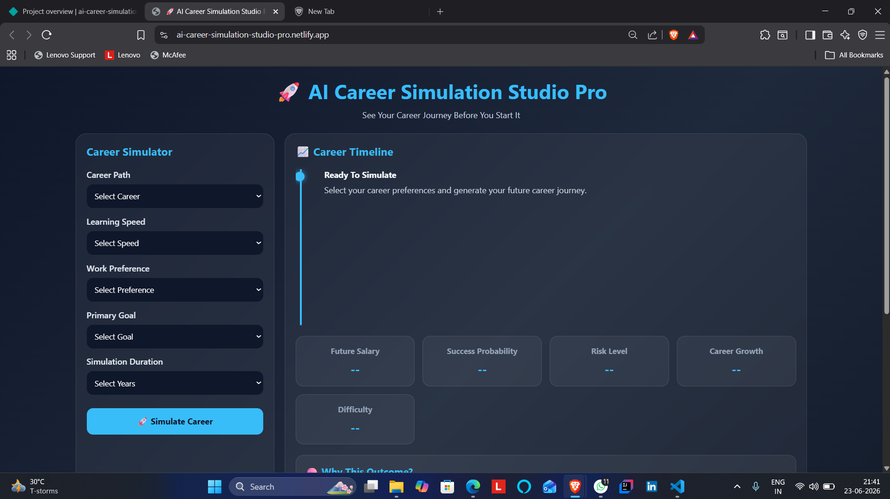
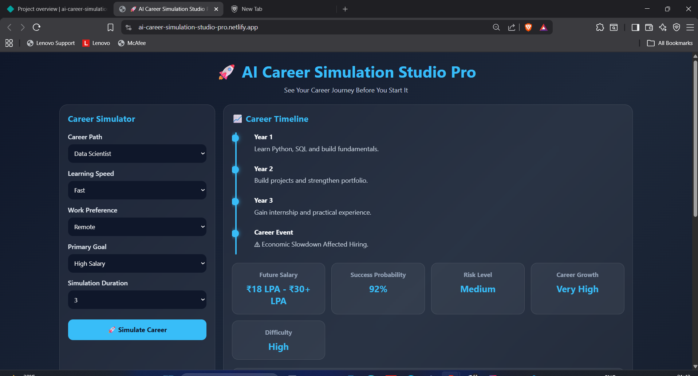
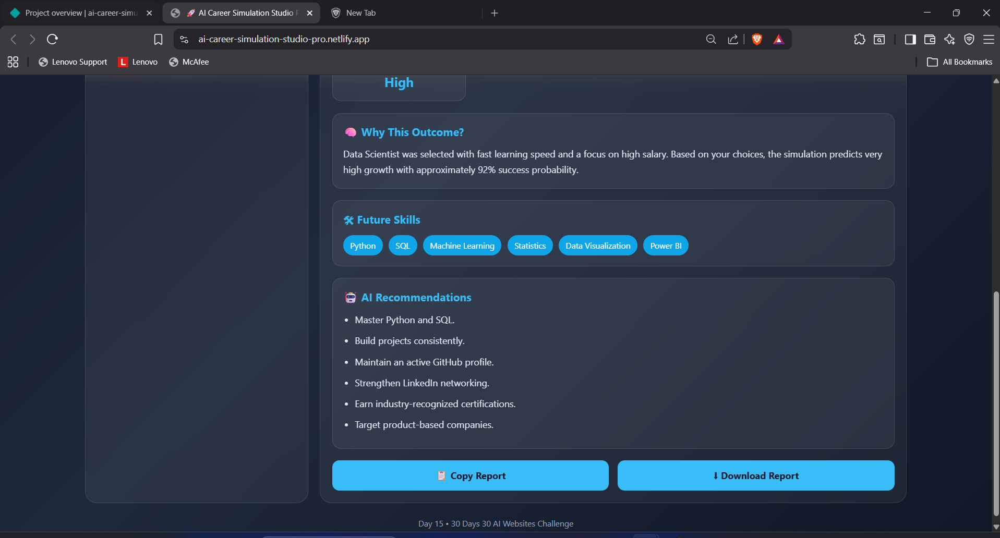

# AI Career Simulation Studio Pro

## 🚀 Day 15 of my 30 Days 30 AI Websites Challenge

AI Career Simulation Studio Pro helps students, job seekers, and professionals simulate their future career journey based on career choice, learning speed, work preference, goals, and experience timeline.

Instead of simply recommending a career, the platform simulates a realistic career path and provides future insights, growth opportunities, risks, and skill recommendations.

## 🌐 Live Demo

https://ai-career-simulation-studio-pro.netlify.app/

## 📸 Screenshots

## ✨ Features

* Career Path Simulation
* Future Salary Prediction
* Success Probability Analysis
* Career Risk Assessment
* Career Growth Forecast
* Difficulty Level Analysis
* AI Career Reasoning
* Dynamic Career Timeline
* Future Skills Recommendation
* Personalized Career Guidance
* Random Career Events Simulation
* Copy Report Feature
* Download Report Feature
* Responsive Design

## 📋 User Inputs

* Career Path
* Learning Speed
* Work Preference
* Primary Goal
* Simulation Duration

## 🎯 Supported Careers

* Data Scientist
* AI Engineer
* Data Analyst
* Cyber Security Analyst
* Full Stack Developer
* Cloud Engineer

## 📊 AI Simulation Outputs

* Future Salary Range
* Success Probability
* Risk Level
* Career Growth Potential
* Difficulty Level
* Career Timeline
* Future Skills
* AI Recommendations
* Career Event Simulation
* AI Reasoning

## 📋 How It Works

1. Select a Career Path.

2. Choose Learning Speed.

3. Select Work Preference.

4. Choose Primary Goal.

5. Select Simulation Duration.

6. Click "Simulate Career".

7. View:

   * Career Timeline
   * Salary Forecast
   * Success Probability
   * Risk Analysis
   * Growth Forecast
   * AI Recommendations

8. Copy or Download the generated report.

## 📌 Example

### Input

Career: AI Engineer

Learning Speed: Fast

Work Preference: Remote

Goal: High Salary

Duration: 10 Years

### Output

Future Salary: ₹20 LPA - ₹35+ LPA

Success Probability: 95%

Risk Level: Low

Growth Potential: Very High

Difficulty: Very High

Future Skills:

* Python
* Deep Learning
* NLP
* TensorFlow
* PyTorch
* LLMs

## 🚀 Challenge

This project is part of my 30 Days 30 AI Websites Challenge, where I build and publish one AI-assisted website every day to improve my development, problem-solving, and product-building skills.

## 📈 Progress

* Day 1 ✅ AI Resume Analyzer
* Day 2 ✅ AI Career Roadmap Generator
* Day 3 ✅ AI Project Idea Generator
* Day 4 ✅ AI Skill Gap Analyzer
* Day 5 ✅ AI Interview Question Generator
* Day 6 ✅ AI Portfolio Review Analyzer
* Day 7 ✅ AI LinkedIn Post Generator
* Day 8 ✅ AI Salary Predictor
* Day 9 ✅ AI Startup Idea Validator
* Day 10 ✅ AI Study Planner
* Day 11 ✅ AI Tech Stack Recommender Pro
* Day 12 ✅ AI Productivity Dashboard
* Day 13 ✅ AI Learning Battle Arena
* Day 14 ✅ AI Resume Bullet Generator Pro
* Day 15 ✅ AI Career Simulation Studio Pro

## 🛠 Technologies Used

* HTML5
* CSS3
* JavaScript
* AI-Assisted Development

## 🎯 Learning Outcomes

Through this project, I explored:

* Career Planning Systems
* Simulation-Based Applications
* User Decision Support Tools
* Dynamic Timeline Generation
* Frontend Application Development
* AI-Assisted Product Development

## 👨‍💻 Author

Bettam Anand

B.Tech CSE (Data Science)

JNTUH University College of Engineering Palair

30 Days 30 AI Websites Challenge
